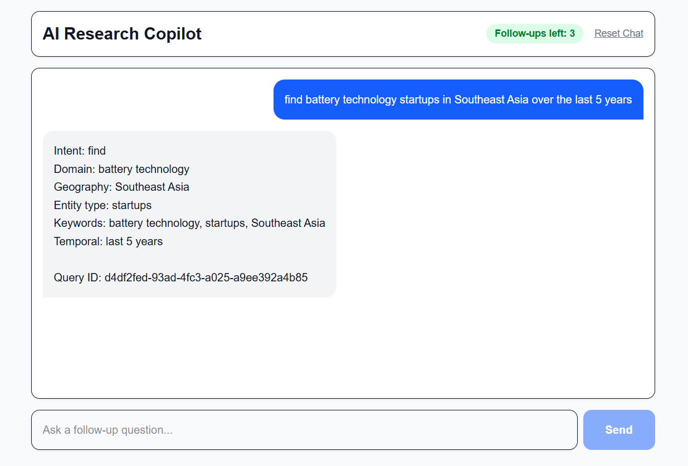
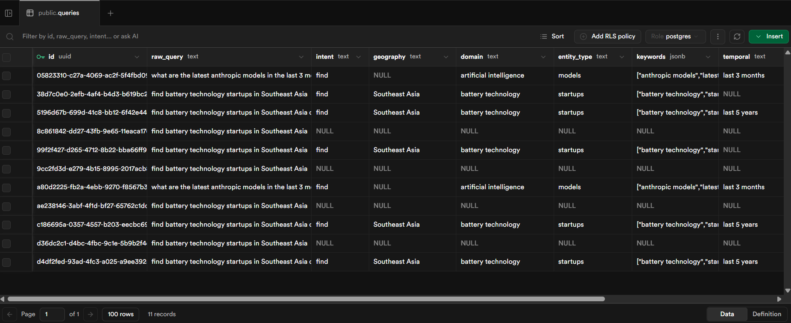

# Spark Studios Task — Query Intelligence Platoform Prototype

This repository contains a Query Intelligence prototype built as part of the Spark Studios internship assignment. It has two main parts:

- `backend/` — FastAPI service that accepts natural-language queries, extracts structured intelligence fields (intent, geography, domain, entity_type, keywords, temporal), and persists results in Supabase.
- `frontend/` — Next.js app with a compact chat-style UI that submits queries and displays the extracted fields in a clean, readable format.

## Short Overview

### Backend

- Built with **FastAPI** — `POST /queries` for extraction and persistence, `GET /queries/{id}` for retrieval by UUID.
- **Modular architecture** across five files: `main.py` (routes), `config.py` (clients), `models.py` (Pydantic schemas), `extraction.py` (LLM orchestration), `database.py` (Supabase helpers), and `rule_extraction.py` (offline fallback).
- **Three-tier extraction strategy** — the system always returns a result regardless of API key availability:
  - **Tier 1 — Anthropic Claude** (primary): highest-quality structured extraction via a carefully engineered system prompt.
  - **Tier 2 — Groq Llama** (secondary): LLM-quality fallback triggered automatically if Claude is unavailable or errors.
  - **Tier 3 — Rule-based engine** (last resort): pure Python, zero network calls, zero API keys required. Matches against hand-crafted knowledge bases covering 8 intent types, 55+ geographies, 28 industry domains, 12 entity categories, and 15 temporal patterns using regex and longest-match heuristics.
- Extracted fields are validated with **Pydantic v2** and stored as structured columns in **Supabase**.

### Frontend

- Minimal **Next.js + TypeScript** chat interface for submitting natural-language research queries.
- Proxies requests through a `/api/queries` route handler to the FastAPI backend and displays all extracted intelligence fields inline in the chat thread.
- Styled with **Tailwind CSS** — lightweight and focused entirely on demonstrating the backend workflow end to end.

## Folder Structure
 
```
query-intelligence/
├── backend/
│   ├── main.py             # App setup, CORS, route handlers
│   ├── config.py           # Env vars + client initialisation (Anthropic, Groq, Supabase)
│   ├── models.py           # Pydantic request / response models
│   ├── extraction.py       # Three-tier LLM extraction orchestrator
│   ├── rule_extraction.py  # Rule-based fallback extractor (no network required)
│   ├── database.py         # Supabase read / write helpers
│   ├── requirements.txt
│   └── .env.example
│
├── frontend/
│   ├── app/
│   │   ├── api/queries/route.ts   # Next.js proxy to backend
│   │   ├── page.tsx               # Chat UI
│   │   ├── layout.tsx
│   │   └── globals.css
│   ├── public/
│   │   ├── demo.png
│   │   └── supabase-data.png
│   ├── package.json
│   └── tsconfig.json
│
└── README.md
```

# Endpoints

## 1. Create & Extract Query

Extracts structured metadata from a natural language query and stores it.

### Endpoint

```http
POST /queries
```

### Request Body

```json
{
  "query": "Show me solar panel installations in Texas in 2023 for residential properties"
}
```

### Example Request

```bash
curl -X POST /queries \
  -H "Content-Type: application/json" \
  -d '{
    "query":"Show me solar panel installations in Texas in 2023 for residential properties"
  }'
```

### Sample Response

```json
{
  "id": "123e4567-e89b-12d3-a456-426614174000",
  "query": "Show me solar panel installations in Texas in 2023 for residential properties",
  "extracted": {
    "intent": "search",
    "geography": "Texas",
    "domain": "energy",
    "entity_type": "installations",
    "keywords": ["solar", "residential"],
    "temporal": "2023"
  }
}
```

---

## 2. Retrieve Query by ID

Fetches a previously stored query along with its extracted metadata.

### Endpoint

```http
GET /queries/{id}
```

### Example Request

```bash
curl /queries/123e4567-e89b-12d3-a456-426614174000
```

### Sample Response

```json
{
  "id": "123e4567-e89b-12d3-a456-426614174000",
  "query": "Show me solar panel installations in Texas in 2023 for residential properties",
  "extracted": {
    "intent": "search",
    "geography": "Texas",
    "domain": "energy",
    "entity_type": "installations",
    "keywords": ["solar", "residential"],
    "temporal": "2023"
  }
}
```

---

# Example Queries

```json
{
  "query": "Which cities in California had the highest EV charging station growth in 2022?"
}
```

```json
{
  "query": "Find commercial wind energy projects in New York after 2021"
}
```

```json
{
  "query": "Show residential solar adoption trends in Florida for 2020"
}
```

---

## Frontend Preview



##  Query Metadata Stored in Supabase



# Possible Improvements / Future Scope

## 1. Redis Caching Layer

To improve performance and scalability, Redis can be added as a caching layer between the API and the database.

Currently, every query retrieval requires a database lookup. With Redis, frequently accessed queries and extracted results can be stored in memory for much faster access.

This would help in scenarios such as:
- repeated query searches
- active user sessions
- faster API response times
- reduced database load

### Proposed Flow

```text
Client Request
      ↓
   FastAPI
      ↓
Redis Cache (fast retrieval)
      ↓
 PostgreSQL Database
```

### Example Use Cases

- Cache recently processed queries
- Store temporary session data
- Cache LLM extraction results
- Improve performance for repeated requests

This makes the backend more production-ready and scalable for larger workloads.

---

## 2. Semantic Search Over Historical Queries

Currently, queries can only be retrieved using their unique ID.

A future improvement would be to add semantic search using vector embeddings. Instead of exact keyword matching, the system would understand the meaning of user queries and return similar previously stored queries.

### Example

If a user searches:

```text
EV battery startups in Asia
```

the system could also return related stored queries such as:
- lithium battery companies in Southeast Asia
- energy storage startups
- electric vehicle battery manufacturers

even if the wording is different.

### Proposed Enhancement

- Generate embeddings for each stored query
- Store embeddings using a vector database such as:
  - pgvector
  - Pinecone
  - ChromaDB
- Perform similarity search during retrieval

### Benefits

- smarter query discovery
- improved research experience
- related query recommendations
- better knowledge retrieval across historical searches

This would transform the project from a simple query storage system into a more intelligent research assistant backend.


## Quick setup

**Backend**

```bash
cd backend
python -m venv venv
venv\Scripts\activate   # Windows
pip install -r requirements.txt
cp .env.example .env     # or create .env with required keys
uvicorn main:app --reload --port 8000
```

**Frontend**

```bash
cd frontend
npm install
npm run dev
```
Interactive API docs at `http://localhost:8000/docs`
 
**Environment variables**
```env
ANTHROPIC_API_KEY=sk-ant-...   # optional — Tier 1
GROQ_API_KEY=gsk_...           # optional — Tier 2
SUPABASE_URL=https://...
SUPABASE_KEY=...
```
At least one LLM key is recommended; the rule-based engine covers the rest.

---

# Author

**Harshal Sharma**  
Created as part of the **Spark Studios Internship Assignment**.
